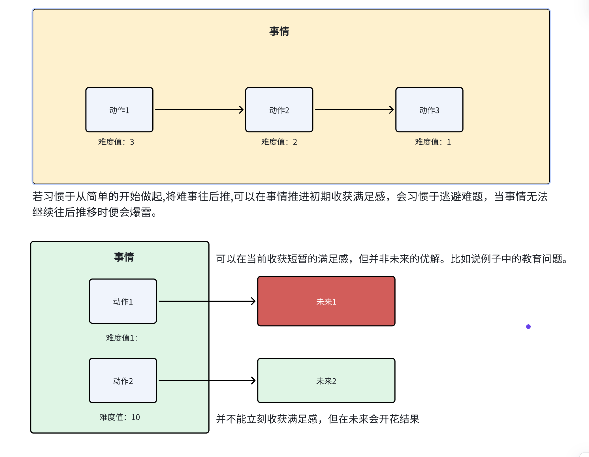

# 开篇介绍

人生苦难重重，有高峰也会有低谷，苦难是人活着必须经历的。而绝大多数人面对苦难，要么是推卸责任，要么是怪天怪地，少有人愿意走向一条成熟的心灵道路。 
当一个人能学会自律，能够学会主动地要求自己以积极的心态承受痛苦时，就离成熟更接近了。 
本书的前篇主要是描述何为自律，人为什么要自律及如何做到自律；后篇则主要为描述爱，何为爱，如何爱与被爱。

## 困难与自律
 
自律：以积极的心态去承受痛苦，解决问题。 
自律的四个原则：
**推迟满足感** 
**承担责任** 
**忠于事实** 
**保持平衡**
## 1、推迟满足感
**例子**：父母的教育。那些喜欢揍孩子、骂孩子的父母，就是不懂得延迟满足感。
他们希望能够以立竿见影的方式解决当前的问题，这可能会在当前解决掉他们的愤怒从而自我满足。
并没有耐心的，从根源上引导孩子，陪伴孩子解决问题，这在未来，可能会让孩子也养成类似的方法论。

**领悟**：何为延迟满足感，完成任何一件事，都可以拆分成若干的**动作**，而这些**动作**又有易与难之分;
各个**动作**可能是线性延伸，也可能是分支选择；我们每完成一个**动作**都会从中收获一定的满足感; 
延迟满足感，则要求我们不能仅仅满足于获得的这一过程，而是要全局的考量**动作**的价值，往往高价值的**动作**都是伴随着难度的。
因此延迟满足感通常与积极主动的解决难题息息相关。 

**训练方式**：做一件事先从难的部分开始做起，这样才能在整个过程中从容不迫。 
如果习惯于从简单的部分开始做，就容易碰到难题就绕开，将其往后推，自我满足于已做的部分而没有发现潜在的威胁，
直到无法往后推时，事情就会乱成一锅粥。

 

## 2、承担责任

**背景名词** 
<strong>神经官能症：</strong>把一切东西都认为是自己的问题。 
<strong>人格失调症：</strong>：认为一切错误都不是自己的问题。

作者举了一个事例：
军营里有个妻子想自杀，他说这个地方太无聊，没有朋友。 
作者问她：“你为什么不去交朋友呢？“ 
“因为我住在该死的居民区，没人说英文。“ 
“那你为何不驾车去美军家属区，或参加军人妻子俱乐部结识朋友呢？“ 
“因为我丈夫白天得开车上班“ 
“既然你白天孤独无聊，为什么不送你丈夫上班呢？” 
“因为汽车是手动挡，我不会开。” 
“你为什么不去学开手动挡的汽车呢？” 
“就在这糟糕的路上学吗？你一定是疯了。” 

故事主人公是典型的[人格失调症](#personality)，这位太太把一切问题都推给了外界，选择逃避问题，归咎于外界，沉溺于现状而作出改变，因此痛苦。承担责任是一种勇气，我们需要直面问题。**你不能解决问题，你就会成为问题**,人非圣贤，我们需要大胆承担属于自己的错误，并解决掉它。
而另一面，对于并非自身的责任，我们也要果断拒绝，否则就会患上[神经官能症](#nerve)，典型的例子-祥林嫂，认为一切都是自己的问题、自己的错，整日担惊受怕。

 

## 3、忠于事实

每个人都会给自己绘制人生地图，每个人在成长过程中，都会根据经验绘制自己的人生地图，如果一个人完全陷入自己的人生地图中就会看不清事实，陷入自己的幻想之中。对于这种人，你很难和他们解释事情，他们会以自己的一套逻辑适用于各类场景。心理学中也叫**移情**，即人们会把对一个人的感情和经历，移植到其他人身上，认为别人也会这样。 
作者举了一个他患者的例子。一个妈妈和女儿的故事。有一个妈妈带女儿来看病，经过几轮治疗，作者认为女儿已经康复了，并告诉了其母亲。她母亲听说后还是不断的碎碎念：“我可怜的女儿啊，为什么要遭这种罪”，不论作者和他解释多少次，她仍旧自说自话，后来作者意识到真正出问题的是母亲。 
这便是不忠于事实，始终根据自己的人生地图来处理问题

 

## 4、保持平衡

任何事物都需要找到平衡点。 
既要拒绝责任，也要承担责任。过度承担责任会患神经官能症，这会让自己很痛苦，过度推卸责任则会得人格失调症，这会让别人很痛苦。 。
既要延迟满足，也要能够快乐过好每一天。一些老人总喜欢先吃较烂的大米，最终一年四季都在吃烂的大米。无限的推迟满足感而没有去享受生活，反而错过了重要的东西。 
以上自律的种种要素都需要找到一个平衡点，这便是自律的最后一个要素。

 

 

## 爱

作者对爱的定义：为了促进自己和他人心智成熟，而不断扩展自我界限，实现自我完善的一种意愿。

容易被错认为爱的几种场景

## 1、过度关注不是爱

**背景名词** 
<strong>消极性依赖人格失调症</strong>：必须得依赖某一个外在的东西，才能感觉到自己的存在。

过度关注的本质是一种依赖，而这种症状的极致便是[消极性依赖人格失调症](#negativity) 
作者举了个例子，有一个人的妻子离世，找到作者哭诉，述说着难过，没有她活不下去之类的，但是三天后却突然跑来和作者说他觉得自己好了，原因是在酒吧遇见了一个妹子说爱他，他又感觉找到了自我。这类人对别人的爱根本与对方无关，只是希望找到一个人能够投射自己到上面。这类人总是苦思如何得到他人的爱，而没有精力去爱别人，如同饥肠辘辘的乞丐只想着讨要而不会分享面包一样。

 

## 2、恋爱并不是爱
感觉不是爱，是欲望。 
恋爱并不是真正的爱，而是自我界限的暂时性崩溃。恋爱可能是爱的发端，但不是爱的本身。

 

## 3、精神贯注并不是爱
例子：养宠物，喜欢宠物。 
有的人养宠物，会觉得自己十分爱宠物，会觉得那个宠物十分懂自己。
但实际上，这仅仅是精神贯注，人以为狗十分懂自己，实际上是将自己的想法投射到了狗的身上；是人在猜想狗的想法。
与爱最根本的区别便是尊重与独立成熟的心智。

 

## 4、自我牺牲并不是爱  