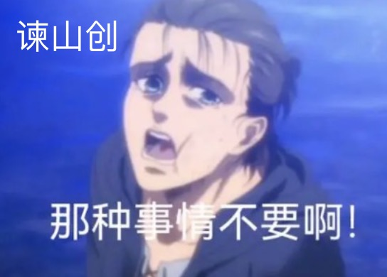

# 关于自由

&ensp;&ensp;学生时代要是有人和我提起“自由”这个词，我多半会想这人在发什么疯，因为这根本不是正常人类能在日常中提到的词，肯定是看了什么自由啊，友咩(梦想）啊之类的动漫或电视剧而暂时性发疯蹦出来的词。但随着不断的成长，认知的深入，我发现自己逐渐喜欢上了这个词。 

 &ensp;&ensp; 从文字构成解读开始，“自由”为“超出目光之处皆为田野”。古人的思路很好理解吧，非常的朴素，有着很大的田，超出生存所需物资便是“自由”。但实际上现在“自由”这两字蕴含的重量远远比它最初的模样要沉重。这很好理解，事物都是在时刻发生变化的，把每个时代的人类的平均期望比做潮汐，那么随着入夜或者说月亮这个外力作用，潮汐所推动的海面也会越来越高。 

&ensp;&ensp;我认为“自由”和“野心”、“真实”、“认知边界”是息息相关的，以公式计算那就是“自由”=“真实”/（野心*认知边界）。举个简单的栗子，几乎所有的小孩子都会认为自己是自由的(当然，是在父母监视之外时，笑～），能奔跑，能笑，能闹，能在自己妄想的世界里无所不能，甚至邀请其他人参与扮演他们妄想世界里的角色，这便是他们的“自由”。因为“认知边界”与“野心” 较小及父母承担了“真实”的缘故，孩童们基本都会认为自己是自由的。而这放在成年人身上就不同了，“真实”受限于自身资源，“认知边界”也被教育扩大达到一个几乎相同的水平，那么在这两个条件相对固定的情况下，“野心”越大的人，就会越不自由，而不越自由的人，就越不开心。所以说，有时候成年人活的还没有一个孩童清醒，用远高于“真实”的“野心”折磨着自己,不断陷入内耗。有时候，将视角抽离出来重新审视自己很重要，我追求的自由是什么?我目前走到的距离是哪里?时代所给予我的认知边界又有多大?通过不断的审视，修正，审视，修正，提高/降低各类占比，便能获得更多的“自由”，当然还是更提倡“真实教派”。 

&ensp;&ensp;现在，重新审视人类的各种需求，是不是会发现归根结底都是为了获得自由？富人追求金钱，是物质的自由；贵人追求权势，是支配的自由；求知者追求理，是认知的自由；老人追求长生，是身体的自由；瞧瞧，每个人都追求着不同大小的东西，都离不开自由的某一个方向，因为有缺失，所以才追求。我小时候做过一个设想，如果我是无所不能的“神”，能够轻易收获所有的自由，那么我将会无聊致死，这也许就是“神”死亡的原因吧。

&ensp;&ensp;于是，我作了一个结论，人生来自由，所追求的东西最终也都是指向了自由。可怕的一点是很多人忘记了自己追求的东西本质是“自由”，这也导致了他们哪怕有着不错的资源却依然过的不快乐。鹏飞于天，却忘记了自己也曾生活在水里。 

(既然是以自由为题，最后必须得鞭尸下谏山创，曾经让我对“自由”这两个字 ptsd 的男人，虽然能大致感觉到他想表达的东西，但仍不能挽回他那抽象派结尾。）
 

